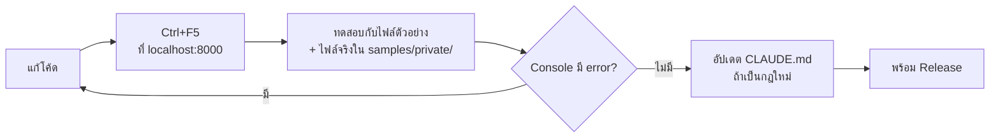

# คู่มือนักพัฒนา — ทำทีละขั้น

คู่มือนี้สอนงานที่ทำบ่อยกับ AHTH Graph Generator ทีละขั้น ตั้งแต่เปิดโปรเจกต์ในเครื่อง จนเอาขึ้นเว็บจริง
อยากรู้ว่าโปรแกรมทำงานอย่างไรก่อน → อ่าน [WORKFLOW.md](WORKFLOW.md) · กฎ/สเปกทั้งหมด → [CLAUDE.md](../CLAUDE.md)

**สารบัญ**
1. [เตรียมเครื่อง](#1-เตรียมเครื่อง)
2. [รันเว็บในเครื่อง](#2-รันเว็บในเครื่อง)
3. [รอบการทำงานปกติ](#3-รอบการทำงานปกติ)
4. [เพิ่มรายการใหม่ในกราฟ/ตาราง (ตัวอย่างเต็ม)](#4-เพิ่มรายการใหม่ในกราฟตาราง-ตัวอย่างเต็ม)
5. [งานแก้ไขที่เจอบ่อย](#5-งานแก้ไขที่เจอบ่อย)
6. [ทดสอบก่อนปล่อย](#6-ทดสอบก่อนปล่อย)
7. [ปล่อยเวอร์ชันใหม่ (Release)](#7-ปล่อยเวอร์ชันใหม่-release)
8. [แก้ปัญหาที่เจอบ่อย](#8-แก้ปัญหาที่เจอบ่อย)
9. [ทำงานร่วมกับ Claude Code](#9-ทำงานร่วมกับ-claude-code)

---

## 1. เตรียมเครื่อง

| ต้องมี | ใช้ทำอะไร | เช็กว่ามีแล้ว |
|---|---|---|
| Python 3 | รัน server ในเครื่อง, สร้างไฟล์ตัวอย่าง | `python --version` |
| Git | เก็บประวัติ / ส่งขึ้น GitHub | `git --version` |
| Browser รุ่นใหม่ (Chrome / Edge / Firefox) | เปิดเว็บทดสอบ | — |
| `openpyxl` (ไม่บังคับ) | สร้าง `samples/sample.xlsx` | `pip install openpyxl` |
| VS Code (ไม่บังคับ) | แก้โค้ด | — |

> ไม่ต้องติดตั้ง Node.js / npm — โปรเจกต์นี้ **ไม่มี build step** แก้ไฟล์แล้วรีเฟรช browser ได้เลย

---

## 2. รันเว็บในเครื่อง

**ขั้นที่ 1** — เปิด terminal ที่โฟลเดอร์โปรเจกต์ แล้วรัน:

```bash
python -m http.server 8000
```

**ขั้นที่ 2** — เปิด browser ไปที่ http://localhost:8000 (หน้าแรก) → กด **วิเคราะห์ไฟล์ Log** หรือเปิด http://localhost:8000/analyze.html ตรงๆ

**ขั้นที่ 3** — กด "ทดลองใช้งานด้วยไฟล์ตัวอย่าง" → ต้องเห็นกราฟและตารางครบทุกหัวข้อ

**ขั้นที่ 4** — กด **F12** → แท็บ **Console** → ต้องไม่มีข้อความสีแดง

> ⚠️ **ห้ามเปิดไฟล์ `.html` ด้วยการดับเบิลคลิก** (`file://...`) — ES modules และ Web Worker ใช้ไม่ได้ หน้าเว็บจะว่าง

> ⚠️ **แก้ไฟล์แล้วเว็บไม่เปลี่ยน?** browser จำไฟล์เก่าไว้ → กด **Ctrl+F5**
> หรือเปิด F12 ค้างไว้ → แท็บ Network → ติ๊ก **Disable cache**

---

## 3. รอบการทำงานปกติ



**ไฟล์จริงสำหรับทดสอบ** ให้ใส่ไว้ใน `samples/private/` (อยู่ใน `.gitignore` ไม่ถูก commit)
ห้ามวาง log จริงไว้ที่อื่นใน repo — repo เป็น **Public**

---

## 4. เพิ่มรายการใหม่ในกราฟ/ตาราง (ตัวอย่างเต็ม)

ตัวอย่าง: สมมติอยากเพิ่ม **สถานะประตู** จากคอลัมน์ `doorsClosed` (1 = ปิด, 0 = เปิด)
เป็น **จุดสีเทา ที่ Y = 51 ตอนประตูเปิด** ในหัวข้อ SYSTEM

> ตัวอย่างนี้ใช้สอนเท่านั้น ยังไม่ได้ทำจริงในโค้ด

### ขั้นที่ 1 — ดูข้อมูลจริงในไฟล์ก่อน

ต้องรู้ 3 อย่าง: **ชื่อคอลัมน์ตรงตัว**, **ค่าที่เป็นไปได้**, **มีในทุกไฟล์ไหม**
รันใน terminal (แก้ path เป็นไฟล์ของคุณ):

```bash
python -c "import collections; L=open(r'samples/private/wlan_d006.log',encoding='latin-1').read().splitlines(); h=[x.strip() for x in L[1].split('\t')]; i=h.index('doorsClosed'); print(collections.Counter(r.split('\t')[i] for r in L[2:] if r))"
```

ผลจากไฟล์ WLAN จริง: `Counter({'1': 1433, '0': 2})` → ค่ามีแค่ 0/1 ✔ (ประตูเปิด 2 ครั้ง)

> ชื่อคอลัมน์เทียบแบบ **ตัดช่องว่างออก และตัวพิมพ์เล็ก/ใหญ่ต้องตรง** (`heaterA` กับ `HeaterA` คนละคอลัมน์)

### ขั้นที่ 2 — เลือกชนิดของรายการ (`kind`)

| อยากให้เป็นแบบไหน | `kind` | ต้องกำหนดเพิ่ม |
|---|---|---|
| เส้นอุณหภูมิ (°C) จากคอลัมน์ `.InC` | เพิ่มใน `SENSORS` แทน | `column`, `err`, `color` |
| เส้นขั้นบันได 2 ระดับ (ON/OFF) | `"line"` | `yWhenZero`, `yOtherwise` |
| เส้นขั้นบันไดเทียบสัดส่วน (0–N) | `"line"` | `rawRange: [min, max]`, `yRange: [yMin, yMax]` |
| สัญลักษณ์ตอนมีเหตุการณ์ | `"marker"` | `shape` (`dot` / `cross` / `circle` / `dash`), `y`, `drawWhen` |
| ตัวเลขในตารางอย่างเดียว | `"value"` | — |

ตัวอย่างประตู → `kind: "marker"`, `shape: "dot"`, วาดตอน `doorsClosed = 0` → `drawWhen: "zero"`

### ขั้นที่ 3 — เพิ่มใน `STATUS_ITEMS` (ไฟล์ `js/logformat.js`)

เปิด `js/logformat.js` หา `export const STATUS_ITEMS = [` แล้วเพิ่ม 1 บรรทัด (ใส่ comment อธิบายค่าด้วย):

```js
  // ประตู: doorsClosed 1 = ปิด, 0 = เปิด → จุดสีเทาที่ Y = 51 ตอนประตูเปิด
  { key: "doorOpen", column: "doorsClosed", group: "system", kind: "marker", shape: "dot",
    color: "rgb(150, 150, 150)", y: 51, drawWhen: "zero",
    th: "Door open", en: "Door open", display: "doorOpen" },
```

**ความหมายของแต่ละช่อง** (ดูคำอธิบายเต็มใน comment ด้านบน `STATUS_ITEMS`)

| ช่อง | ความหมาย |
|---|---|
| `key` | ชื่อภายใน ไม่ซ้ำกับรายการอื่น |
| `column` | ชื่อคอลัมน์ในไฟล์ (ตรงตัว) |
| `group` | หัวข้อในตาราง: `component` / `system` / `temp` / `control` / `heater` / `error` / `other` |
| `color` | สี — **ผู้ใช้เป็นคนกำหนด** ควร contrast ≥ 3:1 ทั้งพื้นขาวและพื้นมืด |
| `th` / `en` | ชื่อที่แสดง (ภาษาไทย / อังกฤษ) |
| `display` | วิธีแสดงช่อง "ค่า ณ เคอร์เซอร์" — มีอยู่แล้ว: `onOff` `raw` `temp` `scaled` `error` `dial` `valve` `damper` `heater` `software` |
| `noAvg` | ไม่แสดงค่าเฉลี่ย (ค่าที่เฉลี่ยแล้วไม่มีความหมาย) |
| `defaultOff` | ไม่ติ๊กเป็นค่าเริ่มต้น |
| `requires` / `absentWith` / `allZeroMeansAbsent` | กฎ "ไม่มีชิ้นส่วนนี้ในตู้" → ไม่ติ๊ก + N/A |
| `dash` / `behind` | เส้นประ / เส้นบางวาดหลังสุด |
| `temp` / `signed8` / `scale` | แปลงค่า: ×0.1 °C / 234 → −22 / × ค่าคูณ |

> แค่นี้ worker ก็อ่านคอลัมน์ให้เอง (`buildColumnMap()` วนทุก `STATUS_ITEMS` ที่มี `column`) ไม่ต้องแก้ worker

### ขั้นที่ 4 — (ถ้าต้องมีข้อความแบบใหม่) เพิ่มใน `cursorText()` (ไฟล์ `js/main.js`)

ถ้า `display` ที่มีอยู่ใช้ได้ (เช่น `onOff`) ข้ามขั้นนี้ได้
ตัวอย่างประตูอยากให้ขึ้น "Open" / "Closed" → เพิ่มใน `cursorText()`:

```js
  if (display === "doorOpen") return v === 0 ? "Open" : "Closed";
```

ถ้าต้องมีหัวข้อใหม่ (ไม่ใช่หัวข้อที่มีอยู่) → เพิ่มใน `TABLE_GROUPS` (ไฟล์ `js/main.js`):

```js
  { key: "door", slot: "right", th: "ประตู", en: "Door" },
```
- ตำแหน่งในรายการ = ลำดับบนจอแนวตั้ง, `slot` = ช่องบนจอแนวนอนกว้าง (`left` / `right` / `below`)

### ขั้นที่ 5 — เพิ่มในไฟล์ตัวอย่าง (`tools/make-sample.py`)

กฎ: **ไฟล์ตัวอย่างต้องมีข้อมูลครบทุกเส้น/ทุกสัญลักษณ์** ให้ผู้ใช้กด "ทดลองใช้งานด้วยไฟล์ตัวอย่าง" แล้วเห็นทุกอย่าง

1. ถ้าคอลัมน์ยังไม่อยู่ใน `NAMED_COLUMNS` → เพิ่มชื่อเข้าไป (`doorsClosed` มีอยู่แล้ว)
2. ใส่ค่าใน `make_row()` — ให้มีทั้งช่วงปกติและช่วงที่เกิดเหตุการณ์ (มีอยู่แล้ว: ประตูเปิดทุก 90 นาที)
3. สร้างไฟล์ใหม่:

```bash
python tools/make-sample.py          # samples/sample.log / .csv / .xlsx + samples/broken/*.log
python tools/make-sample.py --big    # samples/private/big.log (~80 MB ทดสอบความเร็ว, ไม่ commit)
```

### ขั้นที่ 6 — ทดสอบ

1. Ctrl+F5 → "ทดลองใช้งานด้วยไฟล์ตัวอย่าง"
2. เห็นแถวใหม่ในหัวข้อที่ถูก, ภาพลักษณะหน้าชื่อถูก (จุด/เส้น/…), สีถูก
3. ชี้เมาส์ช่วงที่ประตูเปิด → ช่อง "ค่า ณ เคอร์เซอร์" ขึ้นถูก
4. เปิดไฟล์จริงใน `samples/private/` → ค่าถูก, ไฟล์ที่ไม่มีคอลัมน์นี้ขึ้นแจ้ง "ไม่มีคอลัมน์ในไฟล์" แต่ไม่พัง
5. Console ไม่มี error — ดูรายการเต็มใน [ข้อ 6](#6-ทดสอบก่อนปล่อย)

### ขั้นที่ 7 — อัปเดต `CLAUDE.md`

เพิ่มแถวในตาราง "รายการสถานะ (marker)" — ชื่อ, คอลัมน์, หัวข้อ, ลักษณะบนกราฟ, ค่า ณ เคอร์เซอร์, Min/Max/Avg
CLAUDE.md คือ **สเปกหลัก** — ถ้าไม่อัปเดต ครั้งหน้าจะไม่มีใครรู้ว่าตั้งใจให้เป็นแบบนี้

---

## 5. งานแก้ไขที่เจอบ่อย

| อยากทำ | แก้ที่ไหน |
|---|---|
| เปลี่ยนสีเส้น/สัญลักษณ์ | `color` ใน `SENSORS` / `STATUS_ITEMS` (`js/logformat.js`) — error ของเซนเซอร์และค่าตัด/ต่อดึงสีจากเซนเซอร์/พัดลมเอง |
| เปลี่ยนตำแหน่ง Y | `y` (marker), `yWhenZero`/`yOtherwise` หรือ `yRange` (line) |
| เปลี่ยนชื่อที่แสดง | `th` / `en` |
| ย้ายรายการไปหัวข้ออื่น | `group` |
| ย้ายกล่องบนจอแนวนอน / ลำดับหัวข้อ | `TABLE_GROUPS` ใน `js/main.js` (`slot` + ลำดับในรายการ) |
| ค่าเริ่มต้นไม่ติ๊ก | `defaultOff: true` |
| เพิ่ม/แก้ข้อความ TH/EN ใน HTML | attribute `data-th="…" data-en="…"` (ต้องใส่ทั้งคู่ + ข้อความตั้งต้นเป็นภาษาไทย) |
| เพิ่ม/แก้ข้อความที่สร้างจาก JS | `MSG` ใน `js/main.js` แล้วเรียก `t(MSG.xxx, { param })` |
| เปลี่ยนสีพื้น/โหมดมืด | ตัวแปรใน `:root` และ `:root[data-theme="dark"]` (`style.css`) |
| แกน Y | `Y_AXIS_RANGE` (`js/logformat.js`) |
| รองรับรูปแบบวันที่ใหม่ | `parseDateParts()` / `partsToEpoch()` (`js/logformat.js`) + ตารางวันที่ใน CLAUDE.md |
| เกณฑ์ช่วงข้อมูลขาด | `GAP_MEDIAN_FACTOR` (`js/logformat.js`) |

---

## 6. ทดสอบก่อนปล่อย

ทำทุกข้อก่อน push ทุกครั้ง (Ctrl+F5 ก่อนเริ่ม)

**ไฟล์**
- [ ] `samples/sample.log`, `.csv`, `.xlsx` — ขึ้นครบทุกหัวข้อ ทุกเส้นมีข้อมูล
- [ ] ไฟล์จริงใน `samples/private/` อย่างน้อย 1 ไฟล์ต่อรูปแบบ logger (1 วินาที / DataLogger WLAN)
- [ ] `samples/private/big.log` (~80 MB) — โหลดได้ หน้าเว็บไม่ค้าง (ขยับเมาส์/เลื่อนหน้าได้ระหว่างโหลด)
- [ ] `samples/broken/*.log` — ทุกไฟล์ขึ้นข้อความ error ที่อ่านเข้าใจ ไม่ค้าง ไม่มี error สีแดงใน Console

**หน้าจอ**
- [ ] จอแนวนอนกว้าง (≥ 1400px): ตารางอยู่รอบกราฟ ทั้งหมดอยู่ในจอเดียว
- [ ] จอแนวตั้ง / มือถือ (F12 → ไอคอนมือถือ): เรียงลงมา ไม่มีแถบเลื่อนแนวนอน
- [ ] สลับ TH/EN และโหมดสว่าง/มืด — ข้อความ/สีเปลี่ยนครบ กราฟยังอยู่

**การใช้เมาส์**
- [ ] ลูกกลิ้ง zoom, ลากขวาเลื่อน, ลากซ้ายเลือกช่วง (ป้ายระยะเวลาขึ้น), คลิกยกเลิก, ปุ่ม "ดูทั้งหมด", ดับเบิลคลิก = Real data เปิดที่แถว ณ จุดนั้น (ไฮไลต์เหลือง)
- [ ] Min/Max/Avg เปลี่ยนตามช่วง, ค่า ณ เคอร์เซอร์เปลี่ยนตามเมาส์

**จอสัมผัส** (iPad / มือถือจริง หรือ F12 → ไอคอนมือถือ)
- [ ] แตะ = ค่า ณ จุดนั้น, ลากนิ้วแนวนอน = เลือกช่วง, ลากแนวตั้ง = หน้าเว็บเลื่อน
- [ ] จีบ/ถ่าง 2 นิ้ว = ซูม, ลาก 2 นิ้ว = เลื่อนกราฟ, แตะ 2 ครั้ง = Real data ณ จุดนั้น
- [ ] ปากกา (ถ้ามี): ลากเฉียง = เลือกช่วง, ลอยปากกา = ค่า ณ เคอร์เซอร์เปลี่ยน

**Real data**
- [ ] เลือกช่วง → 📋 Real data → ค่าตรงกับบรรทัดเดียวกันในไฟล์จริง, ค้นหาคอลัมน์ / เฉพาะคอลัมน์ที่ใช้ในกราฟได้
- [ ] ไฟล์ใหญ่ทั้งไฟล์: ขึ้นแจ้ง 100,000 แถว, เลื่อนถึงท้ายตารางได้ไม่ค้าง, Export CSV เปิดใน Excel ได้
- [ ] ☆ เลือกคอลัมน์ A → ค้นหา B → ☆ → A กับ B อยู่คู่กันหลังคอลัมน์เวลา, "แสดงเฉพาะคอลัมน์ที่เลือก" ได้
- [ ] คลิกชื่อคอลัมน์ → เรียงน้อย→มาก / มาก→น้อย, กรอง `!=0` / `>100` / `10..20` → จำนวนแถวที่เหลือถูก, Export ได้ตามที่กรอง/เรียง

**CSV ดิบจาก ESP32**
- [ ] เปิด `samples/esp32/uart_log_DataLogger_DEMO01_2026-07-22.csv` → กราฟขึ้น, Model / INI = ESP32 Data Logger, Sampling 600 s
- [ ] กล่องเตือนแจ้งข้าม 1 แถว (hex เสีย "ZZ") / ไฟล์ 07-23 แจ้ง byte ไม่ครบ 120/228 — ไม่มีจุด 0 °C ปลอม
- [ ] Real data แสดงคอลัมน์ที่ถอดแล้วพร้อมชื่อ (ไม่ใช่ hex)

**ติดตามสถานะ Data Logger — ระบบจริง (ต้องมีอีเมลที่รับรหัสได้)**
- [ ] `monitor.html` ไม่ login → ขึ้นหน้าเข้าสู่ระบบ, อีเมลผิดรูปแบบ → "รูปแบบอีเมลไม่ถูกต้อง"
- [ ] ขอรหัส → ได้อีเมล → ใส่รหัสผิด "รหัสไม่ถูกต้อง" → ใส่ถูก → (ผู้ใช้ใหม่) ฟอร์มขอสิทธิ์ → ส่ง → "รอการอนุมัติ" + แอดมินได้อีเมล
- [ ] แอดมิน: `admin.html` → แท็บรออนุมัติ → อนุมัติ → ผู้ใช้ได้อีเมล → ผู้ใช้กด "ตรวจสอบสถานะ" → เห็นการ์ดข้อมูลจริง
- [ ] ถอนสิทธิ์ → ภายใน ~1 นาทีหน้าของผู้ใช้กลับไปหน้าเข้าสู่ระบบ / ขอสิทธิ์ · ผู้ใช้ทั่วไปเปิด `admin.html` → "สำหรับผู้ดูแลระบบเท่านั้น"
- [ ] กดการ์ด → กราฟเต็มของเครื่องจริง, ออกจากระบบแล้วเปิดหน้ากราฟไม่ได้

**ติดตามสถานะ Data Logger (ข้อมูลจำลอง — เปิดด้วย `monitor.html?demo`)**
- [ ] หน้าแรก → การ์ด "ติดตามสถานะ Data Logger" → เห็นแถบข้อมูลจำลอง, DEMO01 Online / DEMO03 ไม่มีข้อมูลจากตู้ (เหลือง) / DEMO02 Offline
- [ ] ชี้เมาส์บนกราฟย่อ → ซอฟต์แวร์ / เวลา / อุณหภูมิ / แผงควบคุมเปลี่ยนตามจุดที่ชี้, ออกจากกราฟ = กลับเป็นค่าล่าสุด
- [ ] ค้นหาชื่อ / กรอง Online-Offline ได้, ตัวเลขในปุ่มกรองถูก
- [ ] กดการ์ด → `analyze.html?device=DEMO01`: กราฟขึ้น, ไม่มีกล่องนำเข้าไฟล์, หัวเว็บ "ติดตามสถานะ Data Logger › DEMO01"
- [ ] ซูม + ปิดบางเส้น → "ปรับปรุงทันที" → ช่วงและเส้นยังเหมือนเดิม · เปลี่ยนช่วงข้อมูล 1 วัน → แสดงเฉพาะวันล่าสุด
- [ ] หยุด / ต่อ ปรับปรุงอัตโนมัติได้

**Time zone**
- [ ] เปลี่ยน Time zone (เช่น America/New_York) → แกนกราฟ, เคอร์เซอร์, ช่องเริ่ม/สิ้นสุด, Period, Real data เปลี่ยนตาม; ช่วงที่เลือก/โน้ตอยู่ที่ข้อมูลเดิม
- [ ] พิมพ์เวลาในช่องเริ่ม/สิ้นสุดตาม time zone ที่เลือก → แสดงช่วงถูก

**Power**
- [ ] ไฟล์ตัวอย่าง: เส้น Power ลง Y=55 แค่จุดเดียว (reset ~00:10 เวลาไทย) — จุดนับเกิน 65535 (~22:56) ไม่ลง

**โน้ต + บันทึกรูป**
- [ ] ✏️ วาดโน้ต → วาดได้, ซูม/เลื่อนแล้วโน้ตอยู่ที่ข้อมูลเดิม, ยางลบ / ล้างโน้ตใช้ได้
- [ ] 💾 บันทึกกราฟเป็นรูป → ได้ไฟล์ PNG ที่มีกราฟ + โน้ต + บรรทัดชื่อไฟล์/ช่วงเวลา

**สุดท้าย**
- [ ] Console (F12) ไม่มี error

---

## 7. ปล่อยเวอร์ชันใหม่ (Release)

> เว็บจริง https://ahth-graph-generator.github.io อัปเดตจาก branch `main` อัตโนมัติ
> **commit อย่างเดียวยังไม่ขึ้นเว็บ — ต้อง push**

**ขั้นที่ 1 — เปลี่ยนเลขเวอร์ชัน**
- `APP_VERSION` ใน `js/site.js` (เช่น `"1.5"` → `"1.6"`)
- บรรทัด "(ตอนนี้ **x.y**)" ใน `CLAUDE.md`

**ขั้นที่ 2 — ทดสอบ** ตาม [ข้อ 6](#6-ทดสอบก่อนปล่อย)

**ขั้นที่ 3 — เช็กว่าไม่มีข้อมูลจริงหลุด** (repo เป็น Public!)

```bash
git status
```

ดูรายการให้ครบ — **ต้องไม่มี** ไฟล์ใน `samples/private/`, log/xlsx/csv จริง, ไฟล์ `~$...` (ไฟล์ล็อกของ Excel)
`.gitignore` กันไว้แล้ว (`*.log`, `*.xlsx`, `*.csv`, `~$*`, `samples/private/`) แต่ต้องดูด้วยตาทุกครั้ง

**ขั้นที่ 4 — commit** (ข้อความภาษาอังกฤษ สั้น)

```bash
git add -A
```

```bash
git commit -m "Release 1.6: add door open marker"
```

**ขั้นที่ 5 — push**

```bash
git push origin main
```

**ขั้นที่ 6 — ตรวจเว็บจริง**
- รอ ~1 นาที (GitHub Pages สร้างเว็บใหม่)
- เปิด https://ahth-graph-generator.github.io แล้วกด **Ctrl+F5** → ป้ายหัวเว็บต้องเป็นเวอร์ชันใหม่
- ถ้ายังเป็นเวอร์ชันเก่า: browser ใช้ไฟล์ที่จำไว้ (GitHub Pages ให้จำได้ ~10 นาที) → F12 → คลิกขวาปุ่มรีเฟรช → **Empty cache and hard reload**

---

## 8. แก้ปัญหาที่เจอบ่อย

| อาการ | สาเหตุ | แก้ |
|---|---|---|
| หน้าเว็บว่าง / Console บอก module / CORS | เปิดด้วยดับเบิลคลิก (`file://`) | รัน `python -m http.server 8000` แล้วเปิด localhost |
| แก้โค้ดแล้วเว็บไม่เปลี่ยน / เวอร์ชันไม่เปลี่ยน | browser cache | Ctrl+F5 หรือ Disable cache ใน F12 |
| "ไม่พบบรรทัด metadata หรือหัวตารางที่มีคอลัมน์เวลา" | คอลัมน์เวลาชื่อแบบใหม่ที่ยังไม่รู้จัก | เพิ่มชื่อใน `TIME_COLUMN_NAMES` (`js/logformat.js`) — ตอนนี้รองรับ `Date / Time`, `Timestamp` |
| ทุกแถวถูกข้าม "วันที่ผิดรูปแบบ" | รูปแบบวันที่ใหม่ที่ยังไม่รองรับ | ดูตัวอย่างวันที่ในไฟล์ → แก้ `parseDateParts()` + เพิ่มในตาราง CLAUDE.md |
| ขึ้น "ไม่มีคอลัมน์ในไฟล์: …" | firmware รุ่นนี้ไม่มีคอลัมน์นั้น / ชื่อไม่ตรง | เช็กชื่อใน header (ตัวพิมพ์เล็ก/ใหญ่) — ถ้าไม่มีจริงก็ปกติ ไม่ต้องแก้ |
| เส้นขาดเป็นช่วงๆ | ช่วงนั้นข้อมูลห่างเกิน 3 × sampling (ข้อมูลขาดจริง) หรือเซนเซอร์ error | ตั้งใจให้เป็นแบบนี้ |
| รายการขึ้น N/A / checkbox ว่างเอง | กฎ "ไม่มีชิ้นส่วนนี้ในตู้" (`requires` / `absentWith` / `allZeroMeansAbsent`, heater สั่งงาน 0 ทั้งไฟล์) | ตั้งใจให้เป็นแบบนี้ — ถ้าผิดดูกฎใน CLAUDE.md |
| Model/INI ยาวผิดปกติ | บรรทัดแรกมีช่องอื่นต่อท้าย | `metadataText()` จัดการแล้ว — ถ้ายังเจอให้ดูบรรทัดแรกของไฟล์ |
| โหลดไฟล์ใหญ่แล้วค้าง | มีการแปลงข้อมูลแบบช้าในหน้าเว็บ | ใช้ loop ธรรมดา ห้าม `Array.from(arr, fn)` กับข้อมูลหลายแสนจุด (ดู "ประสิทธิภาพ" ใน CLAUDE.md) |
| ลอยปากกา (Pencil hover) แล้วเคอร์เซอร์ไม่ขยับ | iPad/ปากกาไม่รองรับ hover หรือ Safari ส่งสัญญาณแบบอื่น | เปิดเว็บด้วย `?pentest` แล้วลอยปากกาเหนือกราฟ ดูกล่องมุมล่างซ้าย — ไม่มีอะไรขึ้นเลย = อุปกรณ์ไม่ส่ง hover |
| `.xlsx` อ่านไม่ได้ | ไฟล์ `.xls` รุ่นเก่า / ไฟล์เสีย | Save As เป็น `.xlsx` หรือ `.csv` |

---

## 9. ทำงานร่วมกับ Claude Code

- Claude อ่าน [CLAUDE.md](../CLAUDE.md) ทุกครั้งที่เริ่ม session → สเปก/กฎทั้งหมดต้องอยู่ในนั้น
- สั่งอะไรที่เป็นกฎใหม่ (สี, ตำแหน่ง, พฤติกรรม) Claude จะเพิ่มลง CLAUDE.md เอง
- **Claude ไม่ commit / push เอง** — แก้ไฟล์ทิ้งไว้ให้ตรวจก่อน ต้องสั่งในแชทครั้งนั้นๆ ถึงจะทำ
- บอกให้ชัด: ชื่อคอลัมน์ตรงตัว, ชื่อที่แสดง, สี RGB, ตำแหน่ง Y, หัวข้อ, ความหมายของค่าแต่ละค่า
  (ดูตัวอย่างรูปแบบคำสั่งจากแถวในตาราง "รายการสถานะ" ของ CLAUDE.md)
