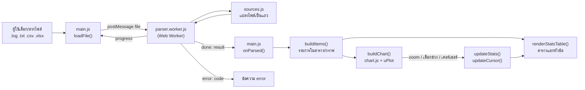
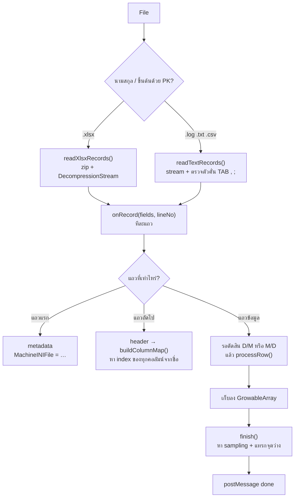
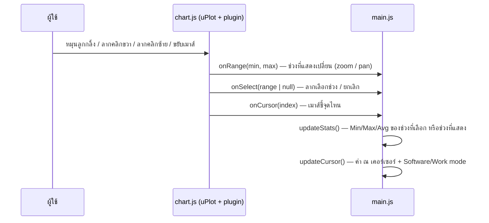

# Workflow — AHTH Graph Generator ทำงานอย่างไร

เอกสารนี้อธิบาย **การไหลของข้อมูล** ตั้งแต่ผู้ใช้เปิดไฟล์ จนกราฟและตารางขึ้นบนจอ
สำหรับนักพัฒนา/คนดูแลโค้ด — อ่านคู่กับ [GUIDE.md](GUIDE.md) (สอนทำทีละขั้น) และ [CLAUDE.md](../CLAUDE.md) (กฎ/สเปกทั้งหมด)

---

## 1. ภาพรวม

- เป็น **static site** บน GitHub Pages: HTML + CSS + JavaScript ล้วน ไม่มี backend ไม่มี build step
- ไฟล์ log **ถูกอ่านใน browser ของผู้ใช้เท่านั้น** ไม่ถูกส่งไปที่ไหน
- ไฟล์ใหญ่ (80–100 MB, ~200,000 แถว) อ่านใน **Web Worker** เพื่อไม่ให้หน้าเว็บค้าง
- กราฟใช้ **uPlot 1.6.32** (โหลดจาก jsDelivr) — library ภายนอกตัวเดียว



---

## 2. ไฟล์และหน้าที่

| ไฟล์ | ทำงานที่ | หน้าที่ |
|---|---|---|
| `index.html` | หน้าเว็บ | หน้าแรก: การ์ดเลือก วิเคราะห์ไฟล์ Log / ติดตามสถานะ Data Logger, ลิงก์เก่าที่มี query (เช่น `/?pentest`) ส่งต่อไป `analyze.html` |
| `analyze.html` | หน้าเว็บ | หน้าวิเคราะห์ไฟล์ Log: โครงหน้า, โหลด uPlot + `js/main.js`, script เล็กใน `<head>` ตั้งโหมดสว่าง/มืดก่อนวาด |
| `js/site.js` | ทุกหน้า | `initSite()`: เวอร์ชัน (`APP_VERSION`), ภาษา, โหมดสว่าง/มืด, นาฬิกาท้ายเว็บ |
| `style.css` | หน้าเว็บ | หน้าตา, โหมดมืด (`:root[data-theme="dark"]`), layout จอแนวนอนกว้าง |
| `js/main.js` | หน้า analyze | จุดเริ่มต้น: ผูก UI, เรียก worker, สร้างรายการ/ตาราง/กราฟ, อัปเดตค่า |
| `js/parser.worker.js` | Web Worker | อ่านไฟล์ทีละแถว, หาคอลัมน์จาก header, ตรวจแถวเสีย, เก็บค่าลง typed array |
| `monitor.html` + `js/monitor.js` | หน้าเว็บ | การ์ด Data Logger: Online/Offline, อุณหภูมิจาก frame ล่าสุด, ค้นหา/กรอง, ปรับปรุงทุก 1 นาที |
| `js/live.js` | หน้า analyze | `?device=<ชื่อ>`: โหลด CSV ของช่วงวันผ่าน `monitor-api.js` → `loadFile(…, { keepView })` ปรับปรุงอัตโนมัติ |
| `js/auth.js` + `js/login-ui.js` | หน้าเว็บ | login ด้วยรหัสทางอีเมล, ขอสิทธิ์, รออนุมัติ, แถบผู้ใช้ — ทุกหน้าที่ต้อง login ใช้ `showAuthGate()` ตัวเดียวกัน |
| `admin.html` + `js/admin.js` | หน้าเว็บ | จัดการผู้ใช้ (แอดมิน): อนุมัติ / ปฏิเสธ / ถอนสิทธิ์ / ลบ |
| `js/monitor-api.js` + `js/config.js` | หน้าเว็บ | ดึงข้อมูลจาก Worker (หรือข้อมูลจำลองเมื่อ `WORKER_URL = null`), จำไฟล์ตาม `modified` |
| `js/espdecoder.js` | Worker | ถอด CSV ดิบจาก ESP32 (`timestamp,raw_hex`, frame 228 byte → 187 ฟิลด์) — `espAdapter()` ใน worker เรียกใช้ แล้วส่งต่อเป็นแถวแบบ log |
| `js/sources.js` | Web Worker | แปลง .log/.txt/.csv/.xlsx เป็น "แถว" (array ของข้อความ) — xlsx อ่านเองไม่ใช้ library |
| `js/logformat.js` | ทั้งสองฝั่ง | **ค่าคงที่ทั้งหมด**: ชื่อคอลัมน์, `SENSORS`, `STATUS_ITEMS`, สี, ตำแหน่ง Y, parse วันที่ |
| `js/chart.js` | หน้าเว็บ | สร้างกราฟ uPlot, การใช้เมาส์ / นิ้ว / ปากกา (zoom/pan/เลือกช่วง), วาดสัญลักษณ์ (marker), บันทึกรูป PNG |
| `js/rawdata.js` | หน้าเว็บ | หน้าต่าง Real data: สั่ง Worker อ่านไฟล์เดิมซ้ำเฉพาะช่วงที่เลือก → ตารางค่าดิบ (virtual scrolling) + Export CSV |
| `js/annotate.js` | หน้าเว็บ | โหมดวาดโน้ต: เส้นผูกกับเวลา+ค่า Y, ความหนาตามแรงกดปากกา, ยางลบ |
| `js/stats.js` | หน้าเว็บ | หาช่วง index จากเวลา, คำนวณ Min/Max/Avg |
| `js/i18n.js` | หน้าเว็บ | สลับภาษา TH/EN (`data-th` / `data-en`, ฟังก์ชัน `t()`) |
| `js/theme.js` | หน้าเว็บ | ปุ่มสลับโหมดสว่าง/มืด, จำค่าใน localStorage |
| `tools/make-sample.py` | เครื่องนักพัฒนา | สร้างไฟล์ตัวอย่าง (ข้อมูลปลอม) และไฟล์เสียสำหรับทดสอบ |

> **กฎสำคัญ:** ค่าคงที่ (ชื่อคอลัมน์, สี, ตำแหน่ง) อยู่ใน `js/logformat.js` ที่เดียว — ส่วนใหญ่การเพิ่มข้อมูลใหม่แก้แค่ไฟล์นี้

---

## 3. ขั้นที่ 1 — เปิดไฟล์ (`main.js`)

1. ผู้ใช้เลือกไฟล์ / ลากมาวาง / กด "ทดลองใช้งานด้วยไฟล์ตัวอย่าง" → `loadFile(file, fileName)`
2. `loadFile()`
   - เพิ่ม `loadToken` (กันผลของไฟล์เก่าที่ยังทำไม่เสร็จมาทับไฟล์ใหม่)
   - สร้าง Web Worker: `new Worker("./parser.worker.js", { type: "module" })`
   - ส่งไฟล์ไป: `worker.postMessage({ file, name })` — ส่งแค่ตัว File object ภายในเครื่อง ไม่มีการ upload
3. รอข้อความจาก worker 3 แบบ:

| ข้อความ | ความหมาย | main.js ทำอะไร |
|---|---|---|
| `{ type: "progress", loaded, total }` | อ่านไปถึงไหนแล้ว | อัปเดต progress bar |
| `{ type: "done", result }` | อ่านเสร็จ | `onParsed()` |
| `{ type: "error", code, params }` | ไฟล์ผิดรูปแบบ | `onParseError()` แสดงข้อความตาม `MSG[code]` |

---

## 4. ขั้นที่ 2 — อ่านไฟล์ใน Web Worker (`parser.worker.js` + `sources.js`)



### 4.1 แปลงไฟล์เป็นแถว (`sources.js`)
- **.log/.txt/.csv** — `readTextRecords()` อ่านแบบ stream (`file.stream()` + `TextDecoder`) ตัดทีละบรรทัด
  ตัวคั่นตรวจจากบรรทัดแรกที่มีตัวคั่น (TAB / `,` / `;`), CSV รองรับ `"..."`
- **.xlsx** — `readXlsxRecords()` อ่าน zip เอง → คลาย `xl/worksheets/sheetN.xml` ด้วย `DecompressionStream` ทีละส่วน
  → แปลง `<row>` เป็น array (เติมช่องว่างที่ xlsx ไม่เก็บ)
- ทั้งสองแบบเรียก `onRecord(fields, lineNo)` เหมือนกัน → ส่วนที่เหลือไม่ต้องรู้ว่าไฟล์เป็นแบบไหน

### 4.2 แถวแรก / header
- แถวแรก: `metadataText()` + `parseMetadata()` → ค่าหลัง `MachineINIFile =` (แสดงเป็น Model / INI)
  - ถ้าแถวแรกเป็น header เลย (ไม่มี metadata) → อ่านต่อได้ แต่แจ้งเตือน
- header: `buildColumnMap()` **หาคอลัมน์ด้วยชื่อเสมอ ห้าม hard-code index** (firmware ต่างรุ่นคอลัมน์ไม่เท่ากัน)
  - คอลัมน์เวลา, `SENSORS`, `STATUS_ITEMS` (+ คอลัมน์ state ของ heater), Stock.* (software), `WorkMode`
  - คอลัมน์ที่ไม่มีในไฟล์ → ใส่ใน `missing` (แจ้งผู้ใช้) แต่ไม่หยุดอ่าน

### 4.3 แถวข้อมูล
- **วันที่:** แต่ละ logger เขียนไม่เหมือนกัน (`7/24/2026 2:53:03 PM`, `16/09/2026 00:00:29`, ISO, ตัวเลข Excel)
  - `parseDateParts()` แยกส่วน → `dateOrderHint()` ดูว่าตัวเลขไหนเกิน 12 เพื่อตัดสิน D/M หรือ M/D
  - ยังตัดสินไม่ได้ → เก็บแถวรอ (สูงสุด 5,000 แถว) แล้วใช้ `defaultDateOrder()` (AM/PM = M/D, 24 ชม. = D/M)
- `processRow()` ต่อแถว:
  1. คอลัมน์ไม่ครบถึงคอลัมน์ที่ใช้ → **ข้ามแถว** (นับ + จำเลขบรรทัด)
  2. วันที่ผิด / เวลาย้อนกลับ → ข้ามแถว
  3. เซนเซอร์: ค่า × 0.1 (°C), ถ้า `*.Err` ≠ 0 → `NaN` (ไม่วาดจุดนั้น)
  4. สถานะ (`STATUS_ITEMS`): เก็บค่าดิบ — ยกเว้น `temp` (× 0.1), `signed8` (234 → −22), heater state (→ None/Off/On)
  5. จุดที่ software / WorkMode เปลี่ยน → เก็บใน `softwareChanges` / `workModeChanges`
- เก็บลง `GrowableArray` (Float64Array สำหรับเวลา, Float32Array สำหรับค่า) — ประหยัด memory กับไฟล์ใหญ่

### 4.4 จบไฟล์ — `finish()`
- `samplingSeconds()` — median ของระยะห่างระหว่างแถว = เวลา sampling อัตโนมัติ
- `insertGaps()` — ช่วงที่ห่างเกิน 3 × sampling แทรกจุด `NaN` → กราฟ **ไม่ลากเส้นข้ามช่วงข้อมูลขาด**
- ส่ง `result` กลับ (typed array ถูก **transfer** ไม่ copy → เร็ว)

### 4.5 หน้าตาของ `result`
```js
{
  ini, metadataMissing,
  times,                 // Float64Array — epoch seconds (เวลาตามที่เขียนในไฟล์ = เวลาไทย; แปลงเป็น time zone ที่เลือกตอนแสดงผลเท่านั้น)
  series: [{ key, values /* Float32Array °C */, allZero }],   // เซนเซอร์อุณหภูมิ
  status: { [key]: Float32Array },   // ค่าของ STATUS_ITEMS ที่มีในไฟล์ (+ "<heater>State")
  softwareChanges: [{ index, time, label }],
  workModeChanges: [{ index, time, value }],
  missing: ["ชื่อคอลัมน์ที่ไม่มี", ...],
  sampling, gapThreshold, gapCount, dateOrder,
  rowCount, duplicateCount, skippedCount, skippedSamples: [{ line, reason, detail }],
}
```

---

## 5. ขั้นที่ 3 — สร้างรายการ ตาราง และกราฟ (`main.js`)

`onParsed()` แบ่งงานเป็นหลาย task (กันหน้าเว็บค้าง) — ถ้าผู้ใช้เปิดไฟล์ใหม่ระหว่างนี้ (`loadToken` เปลี่ยน) จะหยุดทันที

1. **`buildItems(result)`** — แปลง result เป็น "รายการ" 1 รายการ = 1 แถวในตาราง
   | kind | มาจาก | บนกราฟ | ตัวอย่าง |
   |---|---|---|---|
   | `sensor` | `SENSORS` | เส้นอุณหภูมิ | Freezer sensor |
   | `line` | `STATUS_ITEMS` | เส้นขั้นบันได (แปลงค่าเป็นตำแหน่ง Y ด้วย `toStepValues()`) | Compressor, Power, Heater |
   | `marker` | `STATUS_ITEMS` | สัญลักษณ์เล็กๆ ที่ Y คงที่ | Software change, error, Ice making mode |
   | `value` | `STATUS_ITEMS` | ไม่มี (แสดงแค่ตัวเลขในตาราง) | Door open count, Freezer set |
   - ตัดสิน **ไม่มีชิ้นส่วนนี้ในตู้** (`absent`) จาก `requires` / `absentWith` / `allZeroMeansAbsent` → checkbox ว่าง, N/A
   - heater: `buildHeaterItem()` รวมคอลัมน์สั่งงาน + state และคำนวณ duty ด้วย `heaterDuty()` (ถ้า sampling ≤ 1 วินาที)
2. **`renderFileInfo()`** — กล่องข้อมูลไฟล์ (File, Model/INI, Period, Software, Work Mode, Sampling)
3. **`renderStatsTable()`** — แยกรายการตาม `group` → กล่องละหัวข้อ (`TABLE_GROUPS`), เรียงชื่อตามตัวอักษร,
   ใส่ใน slot `left` / `right` / `below` (จอแนวนอนกว้าง) — จอแคบเรียงลงมาด้วย CSS `order`
4. **`buildChart()`** — ส่งเส้น (`seriesList`) และสัญลักษณ์ (`markerLayers`) ให้ `createChart()` ใน `chart.js`
   - เส้น `behind` (ค่าตัด/ต่อ) วาดก่อน = อยู่หลังสุด
   - เส้นขั้นบันไดตอนซูมออกใช้เส้นปกติ (เร็วกว่า ~15 เท่า) ซูมเข้าค่อยใช้ขั้นบันไดจริง

---

## 6. ขั้นที่ 4 — ผู้ใช้โต้ตอบกับกราฟ (`chart.js` → `main.js`)



| การกระทำ | โค้ดที่จัดการ | ผล |
|---|---|---|
| หมุนลูกกลิ้ง | `interactionPlugin` (wheel) | zoom รอบตำแหน่งเมาส์ |
| ลากคลิกขวา | `interactionPlugin` (mousedown button 2) | เลื่อนกราฟซ้าย/ขวา (pan) |
| ลากคลิกซ้าย | uPlot drag (`setScale: false`) + hook `setSelect` | เลือกช่วง + ป้าย `\|◀ 30 min ▶\|` |
| คลิกซ้ายเฉยๆ | `interactionPlugin` | ยกเลิกช่วงที่เลือก |
| ดับเบิลคลิก | `interactionPlugin` (dblclick) → `handlers.onDoublePick(time)` | เปิด Real data + เลื่อนไปแถว ณ จุดนั้น (`scrollToFocus()`) |
| จอสัมผัส: แตะ / ลากนิ้ว / จีบ 2 นิ้ว / ลาก 2 นิ้ว / แตะ 2 ครั้ง | `touchSupport()` | เคอร์เซอร์ / เลือกช่วง / zoom / pan / Real data ณ จุดนั้น |
| ปากกา: ลากทิศไหนก็ได้ / ลอยเหนือจอ | `touchSupport()` | เลือกช่วง / เคอร์เซอร์ตามปลายปากกา |
| ปุ่ม 📋 Real data | `openRawData()` ใน `rawdata.js` → Worker `type: "extract"` | ตารางค่าดิบจากไฟล์ของช่วงที่เลือก — ☆ เลือกเทียบ, คลิกชื่อคอลัมน์ = เรียง/กรอง (`recomputeOrder()`) |
| ช่อง Time zone | `initTimeZone()` / `refreshTimes()` ใน `main.js` → `setDisplayTimeZone()` | เวลาที่แสดงทุกที่ผ่าน `formatDateTime()` / `toDisplayEpoch()` (`logformat.js`) |
| โหมดวาดโน้ต (ปุ่ม ✏️) | `createAnnotator()` ใน `annotate.js` | วาด/ลบโน้ต — เก็บใน `loaded.notes` |

- `updateStats()` ใช้ `indexRange()` (binary search) หา index แล้ว `computeStats()` (ข้าม `NaN`)
- Power: `counterResets()` หาแถวที่ตัวนับ ProTestTimer reset (ค่าลดลง ไม่นับการนับเกินค่าเต็ม) → `item.reset` ใช้วาดเส้นและข้อความ RESET/ON
- ข้อความในตารางจัดรูปตาม `meta.display` ใน `cursorText()` / `statsText()` เช่น ON/OFF, ERROR, Close/Opening/Open, `ON(30%)`

---

## 7. ส่วนเสริมรอบๆ

- **ภาษา (`i18n.js`)** — element ที่มี `data-th`/`data-en` เปลี่ยนเอง, ข้อความจาก JS ใช้ `t({ th, en })`
  เปลี่ยนภาษา → `onLanguageChange` วาดตาราง/ข้อความใหม่
- **โหมดสว่าง/มืด (`theme.js`)** — ตั้ง `data-theme` บน `<html>` → CSS เปลี่ยนสี, กราฟสร้างใหม่ (คงช่วง zoom)
- **เวอร์ชัน** — `APP_VERSION` ใน `site.js` แสดงที่หัวเว็บทุกหน้า
- **ไฟล์ตัวอย่าง** — `samples/sample.*` สร้างจาก `tools/make-sample.py` ต้องมีข้อมูลครบทุกเส้น

---

## 8. สรุปสั้น (จำง่าย)

```
เลือกไฟล์ → main.js ส่งให้ Worker → sources.js แปลงเป็นแถว
→ parser.worker.js หาคอลัมน์จากชื่อ + ตรวจแถว + เก็บค่า → ส่ง result กลับ
→ main.js สร้างรายการ (buildItems) → ตาราง (renderStatsTable) + กราฟ (buildChart)
→ ผู้ใช้ zoom/เลือกช่วง/ชี้ → updateStats / updateCursor
```

อยากเพิ่ม/แก้อะไร → ดู [GUIDE.md](GUIDE.md)
